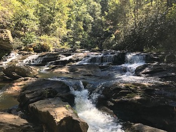
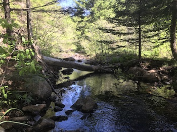

# Urban Ecology & Evolution

## Ecological consequences of urbanization a legume-rhizobia mutualism

{: .align-left} Mutualisms between plants and microbes are critical for community development and ecosystem structure and function. One example of a plant-microbial mutualism is between legumes and rhizobia, whereby legumes provides photosynthate and nodule habitat to rhizobia in return for nitrogen (N) fixed by the rhizobia. For my thesis research, I am using the mutualism between white clover (_Trifolium repens_) and its primary rhizobial symbiont, _Rhizobium leguminosarum_ biovar _trifolii_, to study how urbanization affects the ecology and evolution of mutualisms. 

## Microbiome assembly in urban environments

{: .align-left} Bacteria and fungi comprising the microbiome are important for plant community assembly, physiology, and response to stressors1, 2. As bacteria and fungi can have different functional roles relative to rhizobia, the function of the root microbiome is a multifaceted and emergent property of the ecological roles played by rhizobia, bacteria, and fungi. Alterations to microbiome structure could therefore strongly impact plant communities and associated ecosystem functions.
 
 
For my thesis research, I will be sampling white clover, rhizobia, and soil along an urbanization gradient in Toronto, ON, Canada to (1) evaluate how microbiome composition varies among soil and root compartments and (2) identify the underlying drivers of microbiome assembly and composition. 

I will then complement this work using a manipulative growth chamber experiment to determine how soil microbial communities alter the focal white clover-rhizobia mutualism. I contend that the actual outcome and (co)evolutionary trajectory of legume-rhizobia interactions can only be fully understood when looking at the microbiome as a whole and not as a simplfied, pairwise interaction.

## (Co)Evolutionary ecology of microbiomes in the urban mosaic

# (Meta)Community Ecology

## Community Assembly

{: .align-right} A fundamental question in community ecology is: what drives community assembly? This is not an easy question to answer, as communities are the result of the dynamic interplay between local and regional factors. I am currently working with my partner and fellow researcher Kelly Murray-Stoker to address this question. We are using publicly-available data collected by the United States Environmental Protection Agency to evaluate metacommunity structure and the environmental, landscape, and network variables that best predict realized assemblages at the macroecological scale. We have found that communities can display [consistent metacommunity typologies despite varying drivers of assembly](https://besjournals.onlinelibrary.wiley.com/doi/full/10.1111/1365-2656.13220). Future work will go beyond the [elements of metacommunity structure](https://onlinelibrary.wiley.com/doi/full/10.1034/j.1600-0706.2002.970210.x) and the [paradigm of metacommunity typology](https://onlinelibrary.wiley.com/doi/full/10.1111/j.1461-0248.2004.00608.x) frameworks to (1) test and compare models of community assembly (2) understand community assembly across taxonomic groups and freshwater ecosystem types at the macroecological scale.

## Functional Diversity

{: .align-left} Functional traits provide a mechanistic link between community diversity and ecosystem functioning, although the patterns and drivers of functional trait diversity are difficult to understand and model at large spatial scales. Freshwater ecosystems support a vast amount of biodiversity, but critical evaluation of functional trait structure in these systems at scales common in biogeographical research is limited. I am working with collaborators to quantify functional trait diversity of river and stream communities and to identify predictors of trait diversity across spatial scales. Additionally, I want to examine how communities and associated functional diversity respond to disturbance and environmental change at local, regional, and macroecological scales.

 
## Niches & Community Equilibrium

{: .align-right} Understanding and predicting community responses to environmental change are essential components of community ecology. Evaluating how community composition relates to the niche of organisms comprising the community is one way to measure the effect of environmental filtering and niche matching towards community equilibrium. Through the [framework of disequilibrium theory](https://esajournals.onlinelibrary.wiley.com/doi/full/10.1890/14-0589.1), I am working with collaborators to (1) investigate spatial variation in environmental filtering and niche mismatch and (2) determine the underlying drivers of environmental filtering and niche mismatch. Ultimately, the goal of this project is to inform ecological theory and also conservation and restoration efforts.
