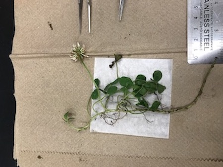
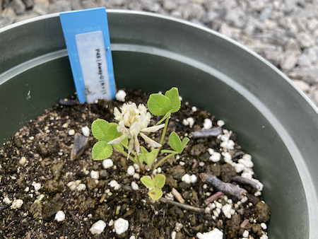
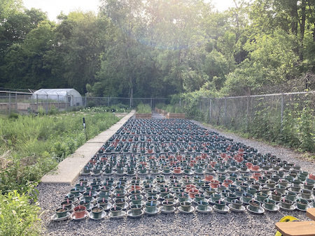
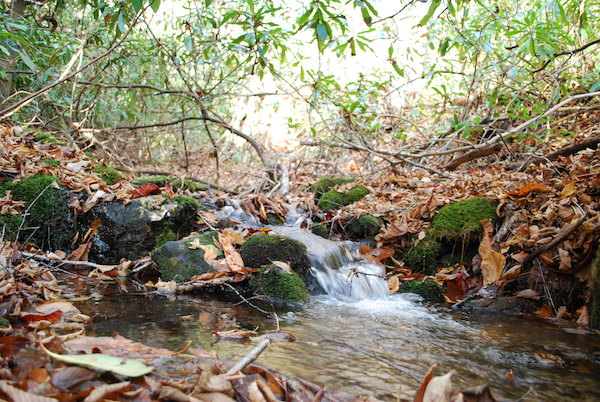
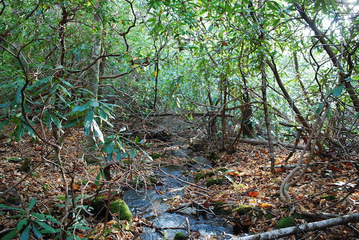

# Urban Ecology & Evolution

## Ecological consequences of urbanization a legume-rhizobia mutualism

{: .align-left} 

Mutualisms between plants and microbes are critical for community development and ecosystem structure and function. One example of a plant-microbial mutualism is between legumes and rhizobia, whereby legumes provides photosynthate and nodule habitat to rhizobia in return for nitrogen (N) fixed by the rhizobia. For my thesis research, I am using the mutualism between white clover (_Trifolium repens_) and its primary rhizobial symbiont, _Rhizobium leguminosarum_ biovar _trifolii_, to study how urbanization affects the ecology and evolution of mutualisms. Urban environments are frequently associated with increased N deposition, acting as both a source and sink for N. As N is the key nutrient in the exchange between white clover and rhizobium, increased N availability should disrupt the interaction in this focal mutualism. Here, I was interested in asking: (**1**) Does rhizobia nodulation vary along an urbanization gradient? (**2**) How does the source of plant nitrogen change along the urbanization gradient? And (**3**) how do urban landscape features influence the interactions and feedbacks between soil N, plant N, and rhizobia nodulation?

From this project, there were three main conclusions: (1) Urbanization decreased investment in the mutualism, (2) white clover acquired N from different sources along the gradient, and (3) there were direct and indirect effects of urbanization on soil nitrogen and white clover-rhizobium interactions. If you would like to read more, [please see the published article](https://onlinelibrary.wiley.com/doi/full/10.1111/oik.08341).

 

## Urbanization and the assembly and diversity of the microbiome of a model legume

{: .align-right} 

Urbanization can drive spatial variation in soil chemistry and nutrients, which can affect the assembly and composition of soil microbial communities. As plant microbiome assembly is ultimately determined by the microbes present in the local soil community, changes to soil microbial composition can affect plant microbiome assembly and function. Notwithstanding growing research into microbiomes, there is limited evidence demonstrating how microbiome assembly and diversity varies within and among natural populations of the same host. This project will begin to fill the gap by quantifying the urban-driven changes to microbiome structure. For my thesis research, I sampled white clover, rhizobia, and soil along an urbanization gradient in the Greater Toronto Area, ON, Canada to (1) evaluate how microbiome composition varies among soil and root compartments and (2) identify the underlying drivers of microbiome assembly and composition. I am currently processing the sequences and assigning taxonomy to amplicon sequences variants, with data analysis on the horizon in early 2023. I hope to have the results and the full story together by late summer 2023. This work will be important for understanding how urbanization affects microbiome assembly, diversity, and compositon across both plant roots and soil compartments.

 

## Local adaptation between white clover and rhizobia in the urban mosaic

{: .align-left} 

Bacteria and fungi comprising the microbiome are important for plant community assembly, physiology, and response to stressors. As bacteria and fungi can have different functional roles relative to rhizobia, the function of the root microbiome is a multifaceted and emergent property of the ecological roles played by rhizobia, bacteria, and fungi. Alterations to microbiome structure could therefore strongly impact plant communities and associated ecosystem functions. Using a manipulative experimental, I am asking (**1**) are white clover and rhizobia locally adapted? (**2**) Does N addition mediate any effects of local adaptation? and (**3**) how does the degree of local adaptation vary with urbanization?

For this experiment, I am using 30 populations of white clover from an urbanization gradient in the Greater Toronto Area, ON, Canada. Each population is crossed with three microbiome (local, nonloca-rural, and nonlocal-urban) and two nitrogen (10 mM KNO3, ambient N) treatments, with 6 replicates for each treatment combination (1080 total plants). At the end of the experiment, I measured fitness estimates for both the plant and rhizobia. I am currently analyzing the data, and I hope to have the results communicated early in 2023. Apart from investigating how urbanization can affect the coevolution of species interactions, this work could also act as a guide or reference point for further investigation into feedbacks between ecology and evolution.

 

# (Meta)community Ecology

## Community assembly and diversity

{: .align-left} 

A fundamental question in community ecology is: what drives community assembly? This is not an easy question to answer, as communities are the result of the dynamic interplay between local and regional factors. I am currently working with my partner and fellow researcher Kelly Murray-Stoker to address this question. We are using publicly-available data collected by the United States Environmental Protection Agency to evaluate metacommunity structure and the environmental, landscape, and network variables that best predict realized assemblages at the macroecological scale. We have found that communities can display [consistent metacommunity typologies despite varying drivers of assembly](https://besjournals.onlinelibrary.wiley.com/doi/full/10.1111/1365-2656.13220). Future work will go beyond the [elements of metacommunity structure](https://onlinelibrary.wiley.com/doi/full/10.1034/j.1600-0706.2002.970210.x) and the [paradigm of metacommunity typology](https://onlinelibrary.wiley.com/doi/full/10.1111/j.1461-0248.2004.00608.x) frameworks to (**1**) test and compare models of community assembly (**2**) understand community assembly across taxonomic groups and freshwater ecosystem types at the macroecological scale.  

I am also interested in patterns and drivers of diversity, taxonomic, functional, and phylogenetic. Working with collaborators on open datasets, I want to quantify functional trait diversity of river and stream communities and to identify predictors of trait diversity across spatial scales. Additionally, I want to examine how communities and associated functional diversity respond to disturbance and environmental change at local, regional, and macroecological scales.

 
 
## Niches and community (dis)equilibrium

{: .align-right}

Understanding and predicting community responses to environmental change are essential components for applying community ecology to global change problems. Evaluating how community composition relates to the niches of organisms comprising the community is one way to measure the effect of environmental filtering and niche matching towards community equilibrium. Through the [framework of disequilibrium theory](https://esajournals.onlinelibrary.wiley.com/doi/full/10.1890/14-0589.1) or DisEQ, we asked:
**Q1** = How do environmental filtering and habitat matching vary across ecoregions?
**Q2** = How does functional trait diversity vary across ecoregions?
**Q3** = Which functional traits are linked to environmental filtering and habitat matching?
**Q4** = What are the environmental predictors of functional trait abundance?

Our study demonstrates spatial patterns of environmental filtering and habitat matching in communities across ecoregions at the macroecological scale, with functional traits providing a critical link between disequilibrium metrics and the environment. [We published the preprint on bioRix](https://www.biorxiv.org/content/10.1101/2022.04.09.487317v2.abstract) and the article is currently in press at the Journal of Biogeography.
