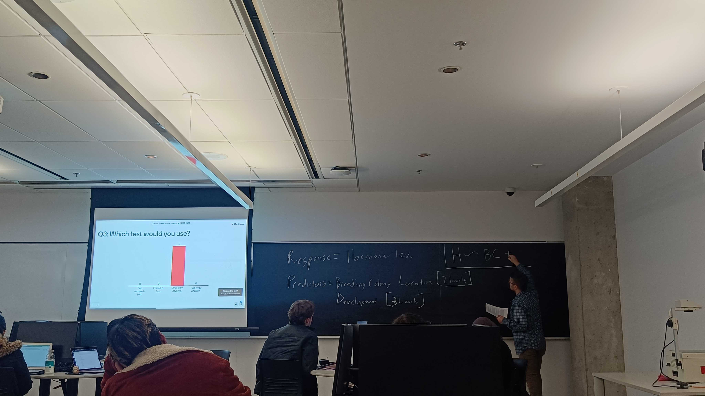

# Teaching Philosophy

**I view learning as a mutualism.** Teachers provide guidance, support, and expertise to students throughout the learning process, and students inform teachers how to be more effective and impactful. Like all interactions, learning depends on the environmental context, so it is important to understand how the learning process is affected by the environment and adapt to changing context. In other words, **learning is an ecology.**

**I make every effort as an instructor to construct a supportive and accessible learning environment.** I provide a space for students to express their curiosity and uncertainty without anxiety or judgement, which is essential to have a sense of belonging and community in STEM fields. The process of learning can bring about discomfort, but I want places of learning – lecture hall, classroom, laboratory, online environment – to harness this discomfort and channel it towards learning. I have high and challenging expectations for my students, and **it is my responsibility to provide a learning environment where every student can grow and learn.**

*“I’ve never been in such an amazing learning environment. I really appreciated how difficult concepts were went over in detail until the majority of the class understood. Regarding the environment of the class, the class was so welcoming and provided students with a safe place to ask questions.”* – Undergraduate Ecology Student (Summer 2023)

*“I always felt supported. From the first day, I could tell how much the instructor deeply cared for his students.”* – Undergraduate Ecology Student (Summer 2023)

**Engaging learning experiences are essential for the learning process to be lasting and impactful.** I design lectures to be active and engaging, with questions during the lecture using Mentimeter and additional activities that work through problems and case studies. If students are still struggling with a concept, I will revisit a topic so that they feel comfortable with their learning. I also gather frequent feedback from students by using check-in and check-out questions to monitor student learning. Students are also able to submit questions anonymously at any point during lectures, so every student gets the support they need.

*“David ensured we were always engaged in the material and made the most of lecture time by providing a medium to ask questions, reviewing concepts we collectively struggled with, and used case studies and class activities to keep us engaged and allow us to apply our knowledge and share our ideas with each other.”* – Undergraduate Ecology Student (Summer 2023)

*“The interactive component really helped to enhance our learning and I think I would have learnt better this way than just standard lectures.”* – Undergraduate Ecology Student (Summer 2023)

**Reflective practices are essential components of my pedagogy.** I use frequent reflections as a way to monitor student learning. I want to know what students learned, how they learned it, and what confusions remain. I also want students to ‘think about thinking’ to understand their learning process: what works, what does not work, how to make the learning process more effective, and time management. Documenting the learning process allows students to become more effective learners, and these skills are transferable to any course, job, or profession.

*“The instructor wanted to learn from the students to find the best way to help the students learn.”* – Undergraduate Ecology Student (Summer 2023)

*“You could really tell that they cared about the success of the students and really went above and beyond to make adjustments when needed to better help the students. The instructor not only cares about this subject, but also cares about the success of the students taking the course and what they can gain from the subject.”* – Undergraduate Ecology Student (Summer 2023)

**Learning can be best assessed by giving students multiple means to express what they know.** I use low-stakes formative assignments, such as reflections, group worksheets, or lecture activities, to see what students are learning and if there are any gaps or misconceptions. Summative assignments, such as term tests, exams, lab reports, concept maps, and course-based research projects, allow students to show what they have learned and what skills they have developed.

**Learning is a process, so I contend that it is too complex to be reduced to a simple number or grade.** I evaluate student learning by following the principles of ungrading. I aim for evaluation to be more of a discussion between teacher and students. I evaluate student work and provide feedback to students, but I also bring students into the conversation. I have students reflect on what they did, why they did it, and how they approached each question or assignment. Mistakes are not only accepted but expected, and I allow students to earn back credit as they document their thought process and continue the learning process. **I do not want learning to stop when an assignment is submitted, because I want learning to be a continuous process.**

*“David ensured that we were truly learning all of the content, as opposed to passively listening and memorizing facts. He gave us many opportunities to practice applying the content to different scenarios through classroom activities and weekly reflections. In the reflections, David clarified any information that students described incorrectly. The lectures were fascinating, and the use of Mentimeter as a tool to gauge our comfort level with the content, as well as a channel for asking questions, was incredibly helpful. There are not many professors who would go to the lengths that David did to ensure that everyone was truly grasping the content and understanding the importance of studying ecology.”* – Undergraduate Ecology Student (Summer 2023)

I also engage in my own reflective practices. I reflect on each lecture, lab, and assignment. I ask myself: What worked well? What could be improved? What was most effective? What did I find challenging? **I am constantly trying to find ways to adapt my pedagogy to better meet the needs and intersectional identities of students and be a more inclusive, supportive, and effective teacher.**

([You can download a PDF of my teaching philosophy here](https://dmurraystoker.github.io/assets/teaching_dossier/D_MurrayStoker_Teaching_Philosophy.pdf))

{: .align-left} 

# Mentoring

I am responsible for teaching, training, and mentoring the next generation of scientists. I know that research experiences are critical for recruiting and retaining undergraduate students, particularly those from historically-excluded fields. It is therefore my moral and ethical obligation to provide as many opportunities as possible for students to gain these experiences. 

I have had the privilege of mentoring three exceptional young scientists on different projects. Elana Maria tested for feedbacks between ecology and evolution in species interactions, where she took the experiment through the entire scientific process and presented the results in a poster presentation. I also mentored Fan Peng Kong and Fathima Amanat on a study in river and stream ecosystems, where both were essential to re-envisioning the analytical approach and interpreting the results. They were also co-authors on the published paper.

{: .align-left} 

# Teaching Dossier

[Here is my teaching dossier](https://dmurraystoker.github.io/assets/teaching_dossier/D_MurrayStoker_Teaching_Dossier.pdf), documenting my professional development, teaching and mentoring experience, and evaluation of teaching effectiveness.

# Example Course Syllabi

Here are example course syllabi for courses I have taught or would like to teach in the future.

[Ecology Syllabus](https://dmurraystoker.github.io/assets/course_syllabi/BIO205_Syllabus_Ecology-Summer_2023.pdf)

[Community Ecology Draft Syllabus](https://dmurraystoker.github.io/assets/course_syllabi/BIO300_Syllabus_Community_Ecology.pdf)

[Biological Data Analysis Draft Syllabus](https://dmurraystoker.github.io/assets/course_syllabi/BIO380_Syllabus_Biological_Data_Analysis.pdf)

# Example Teaching Resources

## Lecture Activity

[Here is an activity I conducted on food webs during a lecture in the Ecology class](https://dmurraystoker.github.io/assets/teaching_materials/BIO205_Lecture_Activity.pdf), with an [example of a food web students put together](https://dmurraystoker.github.io/assets/teaching_materials/BIO205_food_web_diagram.jpeg) during the activity.

## Lab Activities

During the Ecology course-based research, students analyzed soil for macronutrients, pH, salinity, and organic matter content. [Here is the instruction worksheet students used to complete the soil analysis activity](https://dmurraystoker.github.io/assets/teaching_materials/BIO205_Soil_Analysis_Lab.pdf).

Students also analyzed data and created figures using R for their lab reports. [Here is the worksheet providing the instructions for the activity](https://dmurraystoker.github.io/assets/teaching_materials/BIO205_Data_Analysis_Lab.pdf). I have also provided an [example of the R code students used and modified to complete their analyses and create their figures](https://dmurraystoker.github.io/assets/teaching_materials/BIO205_Script_2.Rmd).

To give extra guidance and practice for students with scientific writing, [I developed writing activities](https://dmurraystoker.github.io/assets/teaching_materials/BIO205_Introduction_Writing_Activities.pdf) for students to complete as a group, with a separate individual assignment to help them start working on their lab reports.

## Term Test & Final Exams

I like to use concept maps, case study evaluations and short answer questions, and reflections in my tests and exams. [Here is an example final exam for the Ecology course](https://dmurraystoker.github.io/assets/teaching_materials/BIO205_Final_Exam.pdf).

I also provide the [evaluation and feedback guide](https://dmurraystoker.github.io/assets/teaching_materials/BIO205_Final_Exam_Evaluation_Guide.pdf) students used for their self-evaluations of the final exam.

